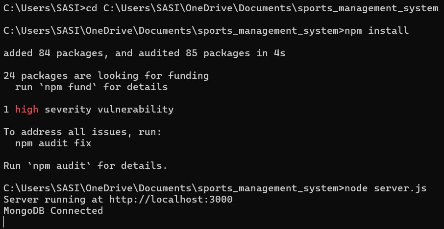
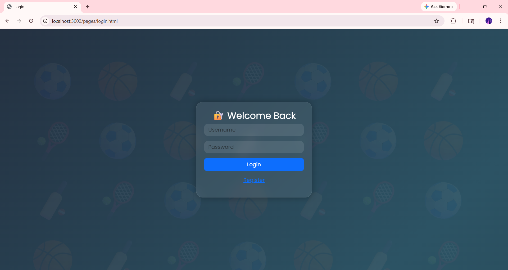
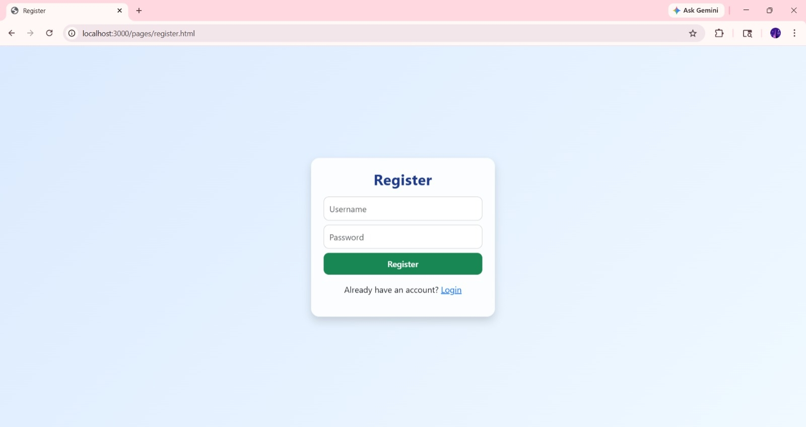
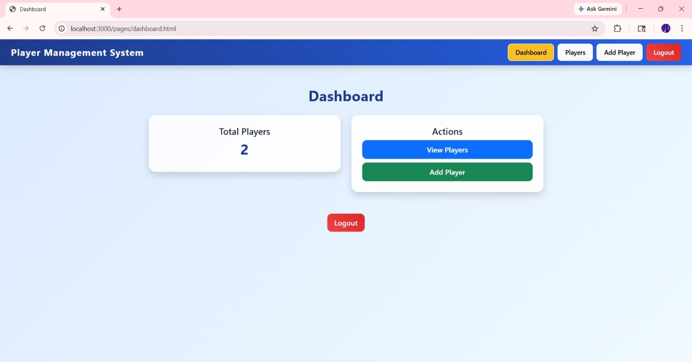
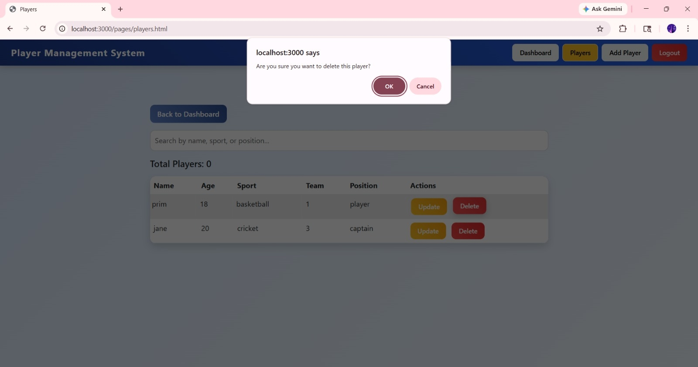

## **Sports Management System**

A full-stack web-based Sports Management System developed to efficiently manage player records. This application allows users to perform complete CRUD operations with a clean UI and additional features like search and filtering.

#### **Project Description**

This system enables users to manage player data digitally, replacing manual record-keeping. It provides a structured interface to add, update, view, search, and delete player information.

The project demonstrates core web development concepts, including frontend-backend integration, REST APIs, and database handling.

#### **Features**

###### **Player Management (CRUD)**

* Add new players with details (Name, Age, Sport, Team, Position)
* View all players in a structured table
* Update player details using a separate edit form page
* Delete players from the system

###### **Search \& Filter**

* Real-time search functionality
* Filter players based on entered keywords (name, sport, team, etc.)

###### **User Interface**

* Clean and responsive UI
* Styled using CSS with hover effects and modern design
* Dashboard with player count display

###### **Authentication**

* User registration and login system
* Basic validation for login credentials

#### **Tech Stack**

###### **Frontend**

* HTML
* CSS
* JavaScript

###### **Backend**

* Node.js
* Express.js

###### **Database**

* MongoDB

#### **Project Structure**

sports\_management\_system/

│

├── models/ # Database schemas (Player, User)

├── routes/ # API routes

├── public/

│ ├── pages/ # HTML pages (login, dashboard, players, add/edit player)

│ ├── css/ # Styling files

│ ├── js/ # Frontend scripts

│

├── package.json # Dependencies

├── package-lock.json

├── server.js # Main server file

#### **How to Run the Project**

1. Download or clone the repository:

git clone https://github.com/SasisrisaiNamburu/Sports_Management_System.git

2\.  Open the project folder

3\.  Install dependencies:

npm install

4\.  Start the server:

node server.js

5\. Open in browser:

http://localhost:3000/pages/login.html

#### **Functionalities Implemented**

* Full CRUD operations for players
* Separate update page (not prompt-based)
* Search and filtering system
* Backend API integration
* Form handling and validation
* Navigation between pages

#### **Future Enhancements**

* Add detailed player information (Gender, Date of Birth, Contact details)
* Advanced filtering options
* Team and match management modules
* Role-based authentication
* Deployment (Render / Netlify / Vercel)

#### **Screenshots**

###### **Run Commands**

###### **Login Page**

###### **Register Page**

###### **Dashboard**

###### **Add Player**

###### **Edit Player**

###### **Delete Player**

#### **Authors**

* Namburu Sasi Sri Sai (Team Leader, Full Stack Development)
* Batta Hema Lalitha (Documentation - README)
* Koneru Naga Sravanthi (Abstract \& Report)
* Mullapudi Purnima Naga Bhavya Sri (PPT Presentation Design)

#### **License**

This project is developed for academic purposes.

